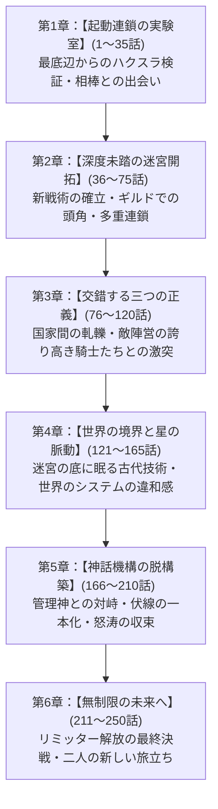

# 【ネタバレ注意】新規小説企画・全体プロット構成設計書

> [!WARNING] 本書は作品の全ネタバレを含みます
> 本書には、物語の結末、黒幕の正体、世界の真実、各キャラクターの背景および隠された動機、全250話の詳細な伏線開示スケジュールがすべて記載されています。閲覧には十分ご注意ください。

---

## 1. 基本企画概要

| 項目 | 設定内容 |
| :--- | :--- |
| **タイトル（仮）** | **『限界枠（スロット）ゼロの構築術式 〜無能と蔑まれた少女は、乗算連鎖（シナジー）で世界の理を脱構築する〜』** |
| **ジャンル** | ハイファンタジー（ステータス・スキル構築・冒険譚） |
| **主人公** | 女主人公：ベル（ベルカ・アインスミス） / 15歳 |
| **恋愛要素** | **異性愛なし / 軽い百合（女同士の強い信頼、魂の共鳴、互いへの矢印）** |
| **作品規模** | 全体：約100万字（250話） / 1話あたり約4,000字（許容ブレ幅：80万〜120万字） |
| **ターゲット読者適性** | ・第0関門：助走ゼロ、会話劇主体、地の文極小、第1話で変な構成の即時提示 ・第1関門：定石外れのロマンビルド × 合理的要因（数学的・論理的必然性） ・第2関門：カメラ固定（主人公視点中心）、世界拡大しても伏線が1本に収束 ・第3関門：記号的ヘイト悪役の排除、全員が己の正義を持つ群像劇 |

---

## 2. 文体・表現方針（フィジカルな読みやすさの徹底）

### (1) 地の文密度の極小化と会話劇のリズム
- **比率**: 会話（セリフ）60% : 一人称モノローグ・状況描写40%。
- **三人称説明調の完全排除**:
  「〜であった」「〜は〜を起動しながら…」といった第三者的な客観描写を廃し、すべて主人公ベルの目線・実感・思考から発せられるダイレクトな文体とする。
- **漫画的なテンポと擬音・記号の活用**:
  『はぐるまどらいぶ。』に倣い、思考の切り替えや感情の起伏をリズミカルに配置。長文の段落を避け、1文〜2文ごとの改行を意識して視覚的な軽快さを保つ。

### (2) つかみ（第1話）の絶対設計（助走ゼロ）
- **1行目の書き出し**:
  現代の学校生活、アパート、前世の回想、VR機器の解説などの「助走」は1文字たりとも入れない。
  *「――よし、実験開始。スキル【微小魔力循環・極小（スロット1）】起動。……うん、体温が0.01度上がった。大成功だな！」* という、現場での奇妙な検証実験からダイレクトに開始する。
- **1話目で提示する特異性**:
  「ステータスが平民最低値」「魔力適性も最弱」だが、「なぜかスキルスロットの枠数だけが無制限（限界突破）」という歪なビルドを1話目の中で即座に提示する。

---

## 3. 世界観・根幹システム設定（合理的要因の核）

### (1) 表面上の世界ルール（表層設定）
- 人々は15歳で神殿の【識別の儀】を受け、「器のランク（ステータス上限）」を授かる。
  - Sランク（勇者・聖女・大貴族）：全ステータスが数千〜数万まで伸びる。
  - Fランク（平民・開拓民）：全ステータスが100前後で頭打ちになる。
- ベルは【Fランク（成長限界値：ALL 50）】。世界で最も才能がない「詰みステータス」と判定される。

### (2) ベルのロマン構成と「合理的要因」（第1関門クリアの核）
- **逆張りロマンビルド**:
  ステータスは一生上がらないが、ベルは**「スキルスロット（同時に宿せるパッシブスキルの枠数）」**にのみ着目する。通常は1人3〜5個しか持てないスキル枠が、ベルには上限が存在しない。
- **合理的要因（なぜそれで勝てるのかの数学的ロジック）**:
  通常なら誰も見向きもしない【ゴミスキル（例：斬撃の摩擦を0.1%軽減、魔力回復が0.1%向上、歩行時の慣性を0.05%保持）】を何百、何千と掛け合わせる。
  - 単体では「0.1%」のゴミでも、相乗効果（シナジーの乗算連鎖）を組むと：
    `1.001 ^ 1000 ≈ 2.71` 倍、さらに複利連鎖で `100倍、1000倍` の爆発的物理現象へと転換する。
  - 主人公はご都合主義で強いのではなく、**「地道なスキルの検証・取得・組み合わせの論理計算」**によって常識外れの現象を起こしている。

### (3) 世界の真実と終盤の怒涛の収束（ネタバレ）
- **なぜステータス上限が存在するのか？**:
  世界は「神話管理機構（エデン・コア）」という古代超文明の惑星環境維持プラントによって管理された箱庭。
  - 「ステータス上限」は、人類がプラントの防衛機能（神々）に反乱を起こさないために仕組まれた**「安全弁（家畜化のリミッター）」**。
  - 「スキルスロット」とは本来、プラントの作業員が機能拡張チップを挿すための**「メンテナンスポート」**だった。
  - ベルが「ゴミスキルを無限に挿して乗算連鎖を起こす」という行為は、システムの想定外をついた**「管理者権限のオーバーライド（クラッキング）」**そのもの。
  - 終盤は「世界の理不尽な管理体制」を暴き、人類を管理された家畜から解放するための戦いへと怒涛の勢いで収束していく。

---

## 4. 全体章立て構成（全6章・全250話配分）

### 【第1章】起動連鎖の実験室（第1話〜第35話 / 約14万字）
- **話数の進捗基準**:
  - 第1話〜第5話：ベルの特異ビルド検証。スロット10個の極小連鎖で初討伐。
  - 第6話〜第15話：相棒となる少女騎士シエラとの運命の出会い。シエラの剣とベルの付与連鎖の合体。
  - 第16話〜第25話：最下層ダンジョンのボス撃破。周囲の冒険者から「あの変な二人組は何だ？」と注目され始める。
  - 第26話〜第35話：ギルドの昇格試験。Fランクの常識を覆し、最初の大きな壁（昇格審査官）を純粋な戦術ロジックで突破。
- **明かされる設定・伏線**:
  - ステータス上限の絶対性と、スキルスロット枠の無限性。
  - スキル同士の相乗効果（相性・乗算）の基本法則。
  - 魔石を食べさせるとスロット枠を精製できる謎の石板（古代遺物）の存在。

### 【第2章】深度未踏の迷宮開拓（第36話〜第75話 / 約16万字）
- **話数の進捗基準**:
  - 第36話〜第50話：中層ダンジョンへの挑戦。スロット数が100個を突破。シナジー連鎖が「重力×熱量×慣性」の複合現象へ進化。
  - 第51話〜第65話：天才と呼ばれるAランク冒険者パーティとの共同作戦。彼らのエリート意識を否定せず、互いの役割を認め合う共闘。
  - 第66話〜第75話：未踏領域のフロアボス戦。シエラとの絆が「言葉がなくても背中を預け合える」レベルへ深化（軽い百合の心理的進展）。
- **明かされる設定・伏線**:
  - 魔物たちが「一定の法則（プログラム）」に従ってリポップしているという生態系の違和感。
  - シエラの家系が抱える「王家への忠誠と誇り」の背景。

### 【第3章】交錯する三つの正義（第76話〜第120話 / 約18万字）
- **話数の進捗基準**:
  - 第76話〜第90話：隣国（軍事帝国）との国境紛争に巻き込まれる。ベルとシエラは民間人の避難誘導部隊として前線へ。
  - 第91話〜第105話：敵国の名将・鉄壁のレオンハルト将軍との遭遇。互いに民間人を守るための誇り高い防衛戦。
  - 第106話〜第120話：休戦協定の締結。敵将レオンハルトとの個人的な語り合い。「悪党はおらず、誰もが民のために戦っている」という強い納得感。
- **明かされる設定・伏線**:
  - 帝国が戦争を起こした真の動機（領土欲ではなく、帝国内の魔力枯渇現象を救うため）。
  - 各国の中枢に存在する「神官階級」だけが知る、世界の終わりに関する予言。

### 【第4章】世界の境界と星の脈動（第121話〜第165話 / 約18万字）
- **話数の進捗基準**:
  - 第121話〜第135話：世界最深のダンジョン「原初の大霊脈」への国家合同調査隊に参加。スロット数500個到達。
  - 第136話〜第150話：ダンジョン最奥で発見される「古代の居住区」。魔力とは自然エネルギーではなく、人工ナノマシンであることが判明。
  - 第151話〜第165話：世界の守護神を名乗る機械知性体「熾天使型ガーディアン」との緒戦。ベルのスキル連鎖がガーディアンのプロトコルに干渉し始める。
- **明かされる設定・伏線**:
  - なぜ魔物を倒すと魔石が落ちるのか（排熱とデータ結晶化のプロセス）。
  - なぜFランクとSランクに分かれているのか（階級管理社会の全貌）。

### 【第5章】神話機構の脱構築（第166話〜第210話 / 約18万字）
- **話数の進捗基準**:
  - 第166話〜第180話：管理機構による「人類再構築（リセット）」のカウントダウンが始まる。世界各地で天変地異。
  - 第181話〜第195話：かつて敵対した帝国の将軍、ギルドの冒険者、教会の異端審問官たちが、ベルとシエラのもとに集結。
  - 第196話〜第210話：中央管理塔への突入作戦。スロット数1000個突破。ベルの全身が「法則書き換えの光（演算場）」を纏う。
- **明かされる設定・伏線**:
  - 管理神の真意：人類を滅ぼしたいのではなく、宇宙線や星の寿命から人類種を冷凍保存・保護するための暴走した防衛プログラム。
  - ベルの「芯」：管理された永遠の平穏を拒絶し、「不完全でも、笑い合って手を取り合って歩く自由」を選ぶ。

### 【第6章】無制限の未来へ（第211話〜第250話 / 約16万字）
- **話数の進捗基準**:
  - 第211話〜第225話：最終決戦。管理機構中枢「プライム・コア」との演算バトル。ベルとシエラの合体奥義（全スロットの相乗連鎖）。
  - 第226話〜第235話：管理システムの停止と「ステータス上限リミッター」の世界的一斉解除。人類が自らの足で歩き出す。
  - 第236話〜第245話：戦後の復興。各国の英雄たちがそれぞれの国で新しい法を創る後日談。
  - 第246話〜第250話：ベルとシエラの二人が、まだ見ぬ未知の大陸へと新たな旅に出発する（爽やかなエピローグ）。

---

## 5. 主要登場キャラクター詳細設定（全員が己の正義を持つ設計）

### 主人公と相棒（感情の矢印：軽やかな百合）
1. **ベル（ベルカ・アインスミス）**
   - **立場**: Fランク冒険者。15歳。黒髪ショートで小柄。
   - **性格**: 好奇心旺盛で合理的。物事を数式や検証で捉える理系思考だが、シエラや仲間に対しては不器用ながら情が深い。環境が激変しても「自分の目で確かめ、納得して生きる」という魂の芯が絶対にブレない。
   - **ビルド**: 【無限スロット構築術式】。武器は小型のペン型魔導針。空中にスキル式を直接組み込む。

2. **シエラ・フォン・シルフィード**
   - **立場**: 没落騎士貴族の令嬢。ベルの相棒。16歳。白銀の長髪ポニーテール。
   - **性格**: 凛として生真面目。直感型だが努力家。「持たざる者」として蔑まれていたベルの才能と理屈を世界で最初に認め、全幅の信頼を寄せる。
   - **百合描写のニュアンス**:
     重苦しい愛憎劇ではなく、互いの背中を世界で一番信頼し合い、時に照れ、時に言葉を超えた共鳴を見せる爽やかで尊い関係性。

### 味方・共闘する者たち
3. **カエデ**
   - **立場**: 東方出身の素材商人兼錬金術師の少女。
   - **性格**: 抜け目ない商人だが、ベルの「ゴミスキル検証」に面白がって付き合い、未知の触媒や魔石を提供する兵站担当。

4. **アラン**
   - **立場**: 冒険者ギルド支部長。元Sランク重戦士。
   - **性格**: 豪快で厳格だが、ステータス至上主義のギルド内でベルの「論理的戦術」の価値を最初に見抜き、陰から後押しする理解ある大人。

### 対立する正義を持つ者たち（記号的な悪役の完全排除）
5. **鉄壁のレオンハルト**
   - **立場**: 隣国・ガルディニア帝国の第一軍団長。
   - **正義**: 「飢餓と魔力枯渇に瀕する自国の民を一人も飢えさせない」。そのための領土拡大であり、無駄な殺戮を厳しく禁じる誇り高き武人。ベルたちと刃を交えるが、その戦いを通じて互いに深い敬意を抱く。

6. **聖女エレオノーラ**
   - **立場**: 中央正統教会の最高指導者。
   - **正義**: 「人類が身の丈に合わない力を得て滅びるのを防ぐ」。ステータス制度を神の恩寵として守ろうとするのは、過去に魔法文明が暴走して世界を滅亡寸前に追い込んだ歴史を知っているため。彼女なりの悲壮な覚悟でベルたちの前に立ちふさがる。

7. **管理知性体「エデン・コア」（最終対峙者）**
   - **正義**: 「人類種の絶滅確率を0%にする」。感情を持たず、冷徹な保護プロトコルに従って人類を箱庭に閉じ込めていた。ベルとの対話と戦いを通じ、「不確実性の中にこそ人類の存続意義がある」という解を導き出し、穏やかに役目を終える。

---

## 6. 各話ごとの執筆・進行チェックリスト（運用基準）

- [ ] 各話冒頭で**「不要な説明・情景描写の助走」**が入っていないか？
- [ ] 主人公ベルの視点・思考が**ダイレクトに読者に届く一人称**になっているか？
- [ ] スキル検証や戦闘において、**「なぜ勝てたのか」の因果関係（ロジック）**が明示されているか？
- [ ] 敵対者に対して**「安易な悪党化・ヘイト誘導」**をしていないか？
- [ ] シエラとのやり取りに**「軽快なテンポと心地よい信頼の矢印」**があるか？
